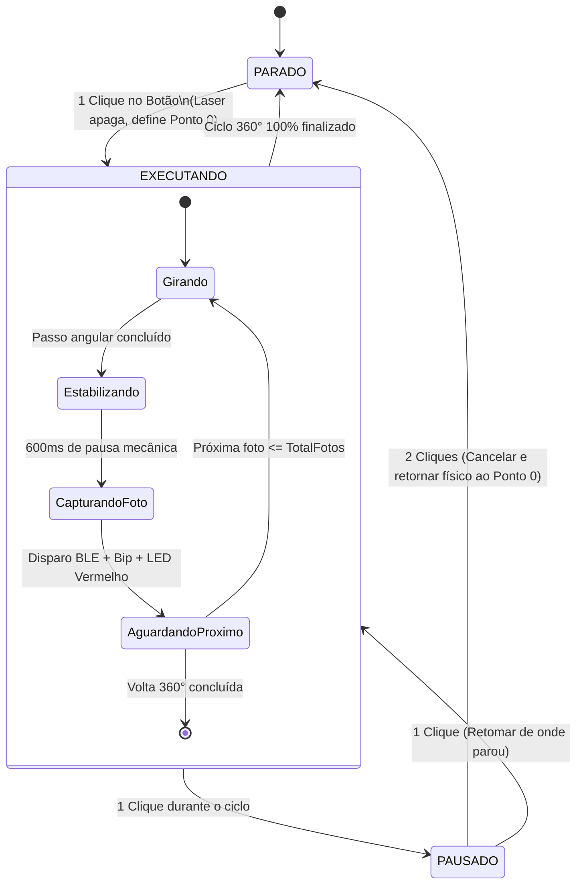

# Sistema Automatizado de Digitalização 3D e Fotogrametria

<p align="center">
  <b>Plataforma IoT Automatizada de Varredura Angular com ESP32, Upcycling de E-Lixo e Disparo Remoto BLE</b>
</p>

<p align="center">
  
  
  
  
</p>

---

## 📖 Visão Geral

O **Sistema Automatizado de Digitalização 3D** é uma plataforma cinemática de alta precisão baseada no microcontrolador **ESP32**, projetada para automatizar o processo de captura fotogramétrica de objetos físicos para reconstrução tridimensional em malhas `.OBJ` / `.STL`.

A mesa executa giros angulares fracionados e perfeitamente uniformes de **360°**, gerenciando pausas mecânicas para a extinção de vibrações estruturais e coordenando o momento exato do disparo fotográfico da câmera do smartphone via **Bluetooth BLE**.

```
   [ Smartphone com Câmera ] 
              ^
              | (Disparo Shutter via BLE)
              v
       [ ESP32 DevKit ] --------> [ Driver ULN2003 + 28BYJ-48 ] 
        |       |    |                          | (Correia elástica)
        |       |    |                          v
        |       |    +---> [ Mira Laser ]  [ Spindle de DVD (Prato 360°) ]
        |       +--------> [ LCD 16x2 I2C + 3 LEDs + Buzzer ]
        +----------------> [ Potenciômetro (8 a 36 fotos) + Pushbutton ]
```

---

## 🎯 Objetivos

1. **Eliminar Inconsistências Manuais:** Resolver a variabilidade humana no espaçamento angular, velocidade de rotação e tempo de estabilização entre capturas.
2. **Garantia de Regularidade Cinemática:** Proporcionar fatiamento angular homogêneo com resolução de menos de $0{,}1^\circ$ por passo de motor.
3. **Automação Ponta a Ponta:** Disparo fotográfico sem contato físico com o smartphone, eliminando qualquer vibração da câmera.
4. **Alinhamento Óptico:** Laser auxiliar integrado para centralização precisa do centro de massa do objeto no eixo de rotação antes do início do escaneamento.

---

## ♻️ Diferenciais e Upcycling (Sustentabilidade)

O projeto maximiza o reaproveitamento de componentes mecânicos de precisão descartados (**e-lixo**):
* **Mancal e Prato Giratório:** Reutilização do conjunto de **spindle com travas esféricas de leitor de CD/DVD de notebook**.
* **Sistema de Redução e Tração:** Polia plástica e correia elastomérica recuperadas do mecanismo de ejeção óptica.
* **Gabinete / Estúdio:** Estruturação em caixas de papelão reaproveitadas formando base eletrônica fechada e câmara escura com fundo infinito para iluminação difusa controlada.
* **Custo Adicional de Eletrônica:** **R$ 0,00** (otimização integral do kit acadêmico).

---

## ⚡ Arquitetura do Hardware

### Mapeamento de Pinos (Pinout ESP32 30 Pinos)

| Função | GPIO ESP32 | Tipo | Descrição |
| :--- | :---: | :---: | :--- |
| **I2C SDA** | `GPIO 21` | Digital / I2C | Linha de Dados do Display LCD 16x2 |
| **I2C SCL** | `GPIO 22` | Digital / I2C | Linha de Clock do Display LCD 16x2 |
| **Motor IN1** | `GPIO 19` | Saída Digital | Bobina 1 do Driver ULN2003 |
| **Motor IN2** | `GPIO 18` | Saída Digital | Bobina 2 do Driver ULN2003 |
| **Motor IN3** | `GPIO 5`  | Saída Digital | Bobina 3 do Driver ULN2003 |
| **Motor IN4** | `GPIO 17` | Saída Digital | Bobina 4 do Driver ULN2003 |
| **LED Verde** | `GPIO 26` | Saída Digital | Indicador de Estado: Standby / Concluído |
| **LED Amarelo** | `GPIO 27` | Saída Digital | Indicador de Estado: Girando / Estabilizando |
| **LED Vermelho** | `GPIO 14` | Saída Digital | Indicador de Estado: Captura de Foto |
| **Mini Laser** | `GPIO 33` | Saída Digital | Emissor Laser de Mira / Centralização |
| **Buzzer** | `GPIO 25` | Saída PWM/Tone | Alertas sonoros de início, foto e fim de ciclo |
| **Push Button** | `GPIO 32` | Entrada Digital | Botão multifunção com `INPUT_PULLUP` interno |
| **Potenciômetro** | `GPIO 36` (VP) | Entrada ADC1 | Ajuste analógico de densidade de fotos (8 a 36 pts) |

### Lista de Componentes (BOM)

| Item | Componente | Quantidade | Função no Projeto |
| :---: | :--- | :---: | :--- |
| 1 | Placa ESP32 DevKit (30 pinos) | 1 un | Unidade Central de Controle e Bluetooth BLE |
| 2 | Motor de Passo 28BYJ-48 (5V) + Driver ULN2003 | 1 un | Atuador cinemático de rotação angular 360° |
| 3 | Display LCD 16x2 com Módulo I2C (PCF8574) | 1 un | Interface visual com status, progresso e BLE |
| 4 | Mecanismo de Spindle de CD/DVD descartado | 1 un | Mancal rotativo e suporte do disco giratório |
| 5 | Módulo Mini Laser 5V / 3.3V | 1 un | Mira óptica para centralização do objeto |
| 6 | Buzzer Piezoelétrico | 1 un | Feedback sonoro do ciclo |
| 7 | LEDs 5mm (Verde, Amarelo, Vermelho) | 3 un | Sinalização óptica dos estados da máquina |
| 8 | Potenciômetro 10kΩ com Knob | 1 un | Ajuste dinâmico da resolução de varredura |
| 9 | Push Button 4 pernas | 1 un | Controle de Início, Pausa, Retomada e Cancelamento |
| 10 | Resistores de 300Ω | 3 un | Limitadores de corrente para os LEDs |
| 11 | Módulo de Fonte de Protoboard (5V / GND) | 1 un | Barramento de potência isolado para o motor |

---

## 🧠 Lógica de Funcionamento e Firmware

### Máquina de Estados Finita (FSM)



### Calculadora de Passos e Ponto Zero Absoluto
O motor de passo 28BYJ-48 realiza **2048 passos por volta completa (360°)** graças à sua redução interna de 1:64.

1. A cada foto $k \in [1, N]$, a posição angular absoluta alvo em passos é calculada por:
   $$\text{PosicaoAlvo}(k) = \text{round}\left((k - 1) \times \frac{2048}{N}\right)$$
2. O firmware comanda o deslocamento incremental $\Delta\text{Passos} = \text{PosicaoAlvo}(k) - \text{PassosAcumulados}$.
3. Ao término dos 360°, a posição física coincide exatamente com a inicial ($0^\circ$).
4. Em caso de **Cancelamento (Duplo Clique)**, a função `retornarAoPontoZero()` inverte o sentido de rotação por $-\text{PassosAcumulados}$, devolvendo a peça à orientação de partida.

### Disparador Automático via Bluetooth BLE
O ESP32 emula um teclado de mídia Bluetooth padrão (**HID Keyboard**). Ao alcançar cada ângulo e aguardar o tempo de atenuação de oscilações (600 ms), o firmware envia o código `KEY_MEDIA_VOLUME_UP`, acionando nativamente o obturador da câmera em dispositivos **Android** e **iOS (iPhone)** sem necessidade de aplicativos de terceiros.

---

## 📁 Estrutura do Repositório

```text
├── firmware/
│   └── Digi_3D_Foto/
│       └── Digi_3D_Foto.ino       # Código-fonte principal para ESP32
├── docs/
│   ├── pinout_esp32.md            # Diagrama e pinagem detalhada
│   ├── manual_operacao.md         # Guia passo a passo de operação
│   └── esquema_mecanico.md        # Detalhes do acoplamento do spindle
├── hardware/                      # Esquemas e fotos do protótipo
└── README.md                      # Este documento
```

---

## 🚀 Como Reproduzir e Executar

### Pré-requisitos
1. **Arduino IDE 2.x** instalada.
2. Suporte à placa ESP32 instalado via Gerenciador de Placas (`esp32` by Espressif Systems).
3. Bibliotecas instaladas:
   - `LiquidCrystal_I2C` (por Frank de Brabander / Marco Schwartz);
   - `Stepper` (nativa do Arduino/ESP32);
   - `ESP32-BLE-Keyboard` (por T-vK).

### Gravação do Firmware
1. Conecte o ESP32 ao computador via cabo USB de dados.
2. Na Arduino IDE, selecione a placa **ESP32 Dev Module** e a porta COM correspondente.
3. Abra o arquivo `firmware/Digi_3D_Foto/Digi_3D_Foto.ino`.
4. Clique no botão **Carregar (Upload $\rightarrow$)**. *(Se o console exibir `Connecting........_____`, segure o botão `BOOT` do ESP32 por 2 segundos).*
5. Pareie o smartphone com o dispositivo Bluetooth **`Scanner 3D Shutter`**.
6. Abra o app da Câmera do smartphone, apoie-o no suporte frontal e pressione o botão físico para iniciar!

---

## 📸 Fluxo de Reconstrução 3D (Fotogrametria)

```
[ 1. Mesa Giratória IoT ] ---> [ 2. Conjunto de Fotos 360° ] ---> [ 3. 3DF Zephyr / Meshroom ] ---> [ 4. Malha 3D (.OBJ / .STL) ]
```

1. **Captura:** O sistema gera entre 16 a 36 fotos com espaçamento angular idêntico.
2. **Alinhamento:** Importação das imagens para o software fotogramétrico (*3DF Zephyr Free*, *Meshroom* ou *RealityCapture*).
3. **Nuvem de Pontos Densa:** Extração de feições por correspondência de pixels.
4. **Malha e Textura:** Geração da geometria poligonal pronta para impressão 3D, realidade aumentada ou computação gráfica.

---

## 📄 Licença
Este projeto foi desenvolvido para fins acadêmicos e científicos sob a licença **MIT**.
